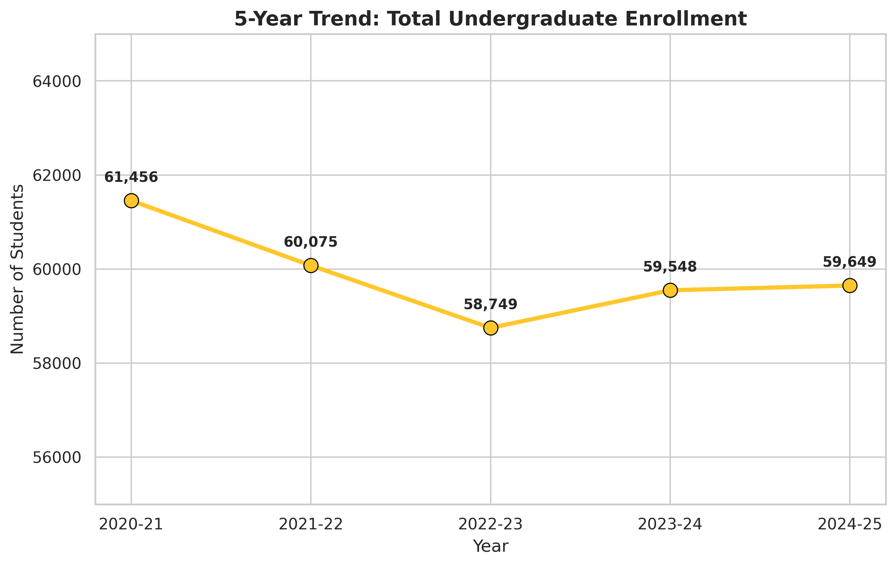
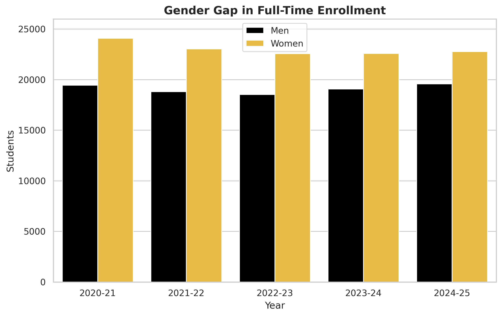
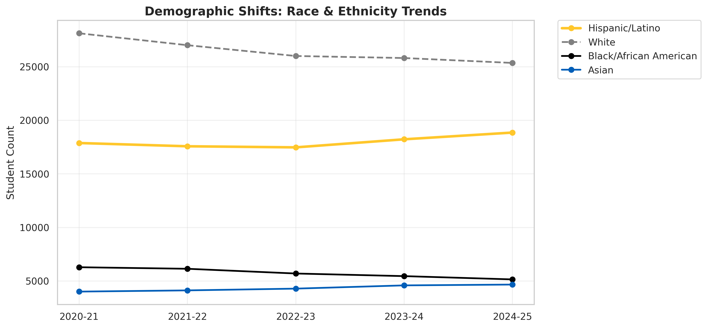
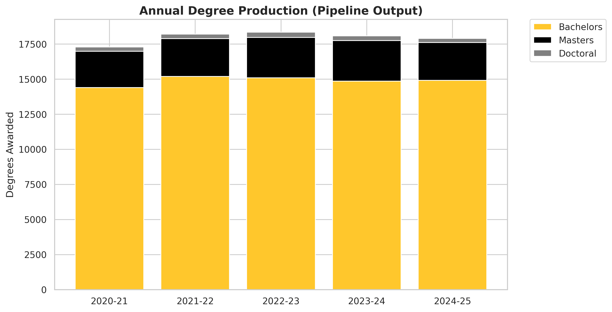
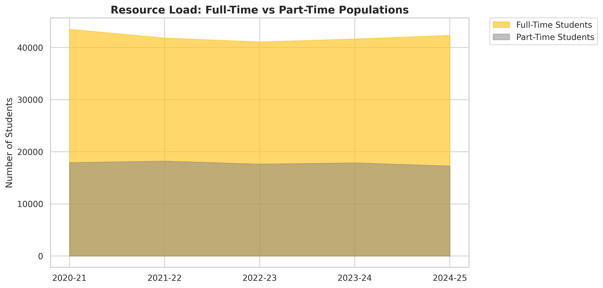
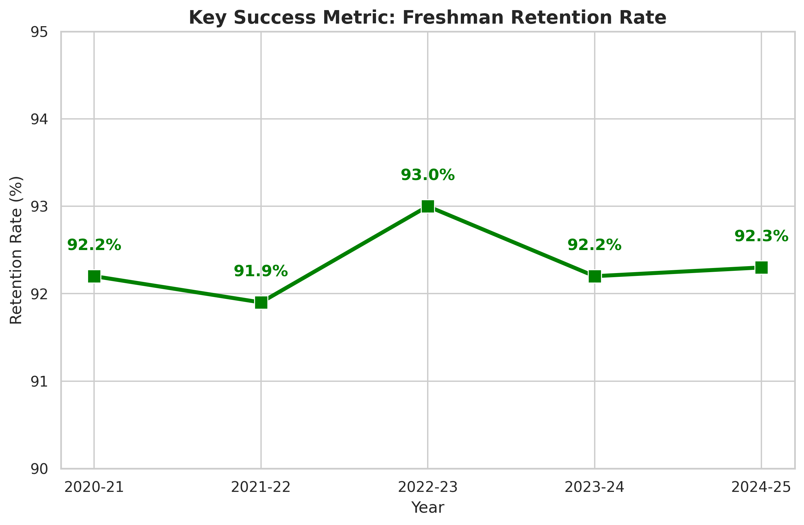

# Strategic Enrollment Analysis: University of Central Florida (2020-2025)

## Executive Summary
This project performs a longitudinal analysis of institutional data from the University of Central Florida (UCF) covering the academic years 2020-2021 through 2024-2025. By aggregating five years of Common Data Set (CDS) reports, this analysis identifies critical post-pandemic trends in student enrollment, demographic shifts, degree production, and retention rates.

The dashboard provides a data-driven "State of the University" view, enabling executive leadership to forecast resource needs and track progress toward strategic diversity and student success goals.

## Data Sources
The data for this project was extracted from the official Common Data Sets published by UCF's Office of Institutional Knowledge Management.
* **Source:** University of Central Florida Common Data Set Archives
* **Years Analyzed:** 2020-21, 2021-22, 2022-23, 2023-24, 2024-25

## Key Insights and Visualizations

### 1. Enrollment Recovery Trends

**Analysis:**
The university experienced a "V-shaped" recovery following the global pandemic. Total undergraduate enrollment peaked at 61,456 in 2020 before declining by approximately 4.4% to a low of 58,749 in 2022. The data indicates a strong rebound in the subsequent years, with the 2024-2025 academic year reaching 59,649 students. This stabilization suggests that recruitment strategies implemented during the recovery phase have been effective, though enrollment has not yet fully returned to the 2020 peak.

### 2. Gender Gap in Full-Time Enrollment

**Analysis:**
A persistent gender gap exists within the full-time undergraduate population. Across all five years analyzed, female enrollment has consistently exceeded male enrollment by a margin of approximately 3,000 to 4,000 students annually. This trend is consistent with national higher education patterns but highlights a potential area for targeted recruitment if a balanced gender ratio is a strategic priority.

### 3. Demographic Shifts and Diversity

**Analysis:**
The racial and ethnic composition of the student body is undergoing a significant transformation.
* **Hispanic/Latino:** This demographic shows a consistent upward trend, growing from 17,880 in 2020 to 18,856 in 2024. This steady growth reinforces the university's status as a Hispanic Serving Institution (HSI).
* **White:** Conversely, enrollment among White students has declined by nearly 3,000 students over the five-year period.
* **Asian & Black/African American:** These populations remain relatively stable, with slight fluctuations correlating with overall enrollment trends.

### 4. Degree Production Pipeline

**Analysis:**
Despite fluctuations in enrollment, the university's output of degrees remains highly stable. Bachelor's degree conferrals hover consistently around the 14,900 mark annually. This resilience suggests that retention and graduation pipelines remained robust even during periods of lower enrollment. However, Doctoral degree production shows a slight decline in the most recent year (290 in 2024 vs. 365 in 2022), which warrants further investigation into graduate research support and funding.

### 5. Resource Load: Full-Time vs. Part-Time

**Analysis:**
The majority of the student population attends full-time, placing a consistent load on campus resources such as housing, dining, and classroom space. The ratio of full-time to part-time students has remained relatively constant, indicating that the fundamental nature of the student experience at UCF has not shifted significantly toward part-time study despite the increase in online learning options post-pandemic.

### 6. Student Success: Freshman Retention Rate

**Analysis:**
The Freshman Retention Rate is a primary Key Performance Indicator (KPI) for student satisfaction and academic support quality. The data shows exceptional stability, fluctuating only slightly between 91.9% and 93.0% over the five-year period. Maintaining a retention rate above 90% is a strong indicator of effective First-Year Experience programs and successful academic advising.

## Strategic Recommendations
Based on this longitudinal analysis, the following actions are recommended for university leadership:

1.  **Invest in Hispanic Student Support:** With the Hispanic/Latino population being the primary driver of demographic growth, budget allocations for Hispanic Student Services and bilingual family outreach should be increased to ensure continued success and retention for this group.
2.  **Review Doctoral Incentives:** The recent dip in research doctoral degrees suggests a need to evaluate the competitiveness of PhD stipends and the availability of research grants to attract top-tier graduate talent.
3.  **Optimize Campus Facilities:** With enrollment stabilizing near 60,000 and the full-time student population remaining dominant, campus facility planning (parking, housing, recreation) should assume high daily utilization rates will continue.

## Technologies Used
* **Python:** Primary programming language for data analysis.
* **Pandas:** Used for data manipulation and time-series management.
* **Matplotlib & Seaborn:** Used for generating professional-grade statistical visualizations.

## How to Run This Project
1.  Clone this repository.
2.  Ensure you have Python installed with `pandas`, `matplotlib`, and `seaborn` libraries.
3.  Run `enrollment_analysis.ipynb`.
4.  The script will generate the 6 visualization files in the root directory.
